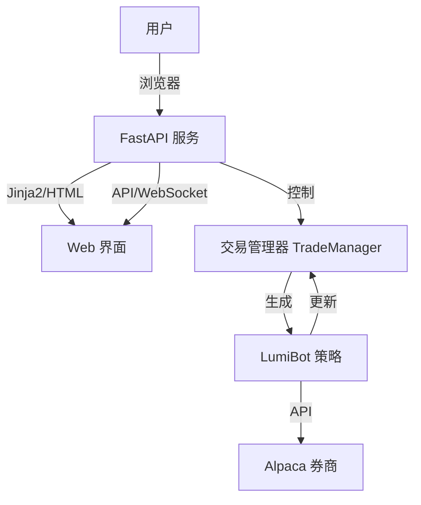

# 设计: MVP 架构

## 系统概览

系统由一个 **Python 整体应用** 组成，使用 FastAPI 同时处理 API 请求和前端页面渲染。

## 详细设计

### 1. Web 服务 (`autotrade`)

- **框架**: FastAPI。
- **结构**:
  - `main.py`: 入口点，配置 API 路由，挂载静态文件，配置模板。
  - `manager.py`: 单例 `TradeManager`，持有活跃的策略实例和最新状态（信号、订单）。
  - `strategies/`: 包含 `SimpleStrategy`。
  - `templates/`: 存放 HTML 模板 (Jinja2)，作为 React 应用的容器。
  - `static/`: 存放自定义 JS 组件 (`app.js`, `dashboard.js`)。
- **并发**:
  - LumiBot 的 `trader.run()` 是阻塞的。我们将根据需要在 `threading.Thread` 中运行它。
  - FastAPI 保持异步处理 Web 请求。

### 2. 前端实现 (React + Tailwind CDN)

- **技术栈**:
  - **React & ReactDOM**: 通过 CDN 引入 (`unpkg.com`)。
  - **Babel**: 通过 CDN 引入，用于在浏览器端编译 JSX。
  - **Tailwind CSS**: 通过 CDN 引入脚本，快速实现样式。
  - **FastAPI + Jinja2**: 提供基础 HTML 骨架。
- **组件化**:
  - 虽然没有构建步骤，我们将使用 React 函数式组件。
  - 组件代码将直接写在模板中的 `<script type="text/babel">` 或独立的 `.js` 文件中。
- **样式**:
  - 使用 Tailwind Utility 类 (e.g., `bg-slate-900 text-white`)。
  - 保持“丰富美学”，大量使用 gradients, glow effects, glassmorphism (通过 Tailwind 的 `backdrop-blur`, `bg-opacity` 实现)。
- **页面**:
  - `/`: 仪表盘。展示实时指标卡片、实时日志、活跃订单表格。
  - `/backtest`: 回测页。表单输入参数，使用 `Chart.js` 展示回测结果图表。
- **通信**:
  - 简单的 `fetch` API 用于命令（如“开始回测”）。
  - `WebSocket` (`/ws`) 用于推送实时价格和订单更新。

### 3. 策略 (`SimpleStrategy`)

- 逻辑: 移动平均线交叉 (例如: SMA 10 vs SMA 30)。
- 事件: 在 `on_trading_iteration` 中，更新 `TradeManager` 的状态。

### 4. 运行器 (`make run`)

- 只需运行一个命令：`uv run uvicorn autotrade.main:app --reload`。

## UI/UX 设计规范

- **配色**: 使用 Tailwind 默认的 Slate/Zinc 色板作为深色背景，Cyan/Purple 作为强调色。
- **交互**: 使用 React 状态管理 (`useState`, `useEffect`) 处理实时数据流。
